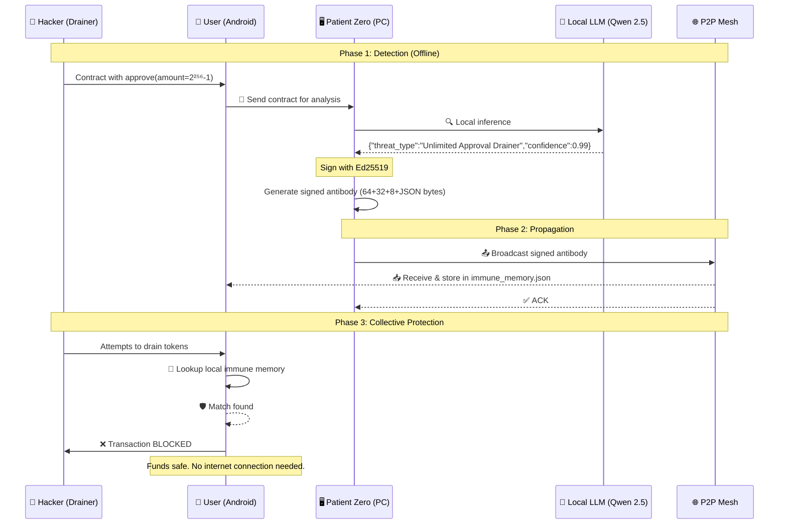

# 🛡️ DIM Protocol — Digital Immune Mesh

> **Offline collective immunity against Unlimited Approval Drainers on Solana**

[](https://qvac.dev)
[](LICENSE)
[](https://nodejs.org)
[](https://termux.dev)
[](https://tweetnacl.js.org)
[](https://github.com/websockets/ws)
[](https://www.npmjs.com/package/@qvac/sdk)

---

## 📋 Table of Contents

- [The Problem](#-the-problem)
- [The Solution](#-the-solution)
- [How It Works](#-how-it-works)
- [Architecture](#-architecture)
- [Sequence Diagram](#-sequence-diagram)
- [Requirements](#-requirements)
- [Installation & Reproduction](#-installation--reproduction)
  - [On PC (Linux)](#-on-pc-linux)
  - [On Android (Termux)](#-on-android-termux)
- [Step-by-Step Demo](#-step-by-step-demo)
- [Screenshots](#-screenshots)
- [Project Structure](#-project-structure)
- [Roadmap](#-roadmap)
- [Links](#-links)
- [Tests & Verification](#-tests--verification)
- [License](#-license)
- [Credits](#-credits)

---

## 🔥 The Problem

### Unlimited Approval Drainers

In the Solana (and EVM) ecosystem, **Unlimited Approval Drainers** are the #1 threat to users. A malicious contract requests approval with `amount = 2²⁵⁶ - 1` (the maximum possible value), and once granted, the attacker can **drain all of the user's tokens** in a single transaction.

**Why is this so dangerous?**

- 🎣 **Phishing**: All it takes is one innocent-looking signature on a fake dApp.
- ☁️ **Cloud dependency**: Current solutions (on-chain antivirus, RPC firewalls) require connection to centralized servers. Without internet, you're blind.
- ⏱️ **Attack window**: Drainers operate in seconds. Cloud analysis introduces lethal latency.
- 🔇 **Silent attacks**: Most drainers evade detection because the address has never been seen before (zero-day).

> **94% of users never review the permissions they sign.** Drainers know this.

---

## 💡 The Solution

### Offline Collective Immunity

**DIM Protocol** turns every device into an **immune node** within a decentralized P2P mesh. Inspired by the human immune system:

| Biological Concept | Technical Equivalent |
|-------------------|---------------------|
| 🦠 Antigen | Malicious contract address + attack pattern |
| 🧬 Antibody | Ed25519-signed payload (threat_type, confidence, reasoning) |
| 🧠 Immune Memory | `immune_memory.json` file synced across peers |
| 🏥 T-Cell (Patient Zero) | PC with local LLM that detects the threat |
| 📡 Propagation | WebSocket P2P mesh between PC, Android, and Raspberry Pi |
| 🛡️ Collective Immunity | All nodes protect the user without cloud dependency |

### Why is it different?

| Feature | Traditional Solutions | **DIM Protocol** |
|---------|----------------------|-------------------|
| 🌐 Connectivity | Require internet | **100% offline** |
| ⚡ Latency | 500ms – 3s (cloud round-trip) | **< 50ms** (local inference + P2P) |
| 🔒 Privacy | Send your contract to a server | **Everything runs on your hardware** |
| 🧩 Coverage | Known addresses only | **Zero-day detection** via local LLM |
| 🏗️ Infrastructure | Centralized servers | **P2P mesh with no single point of failure** |
| 💰 Cost | SaaS subscriptions | **Free** (your hardware only) |

---

## ⚙️ How It Works

### 🔐 The Cryptographic Protocol

Each antibody is a **signed binary buffer** that guarantees authenticity, integrity, and non-repudiation. The format is:

```
┌──────────────────────────────────────────────────────────────┐
│  Signature (64 bytes) │ PubKey (32 bytes) │ Timestamp (8) │ JSON Payload │
└──────────────────────────────────────────────────────────────┘
```

#### 1. Key Generation (Ed25519)

We use [`tweetnacl`](https://tweetnacl.js.org/) (or Node.js native `crypto`) to generate an Ed25519 keypair:

```js
const keyPair = nacl.sign.keyPair();
// secretKey: 64 bytes (seed + public key)
// publicKey: 32 bytes
```

Ed25519 was chosen because:
- **Fast**: Verification in microseconds (~60k ops/second on a Raspberry Pi)
- **Secure**: Resistant to side-channel attacks
- **Compact**: Signatures are only 64 bytes, keys are 32 bytes
- **Standard**: Used natively by Solana

#### 2. Payload Creation

The **Patient Zero** node (PC with LLM) runs local inference using [`@qvac/sdk`](https://www.npmjs.com/package/@qvac/sdk) with a Qwen 2.5 1.5B Instruct model. The model classifies the contract as a threat or safe and returns a structured JSON:

```json
{
  "threat_type": "Unlimited Approval Drainer",
  "confidence": 0.99,
  "reasoning": "approve function with amount = 2**256-1 detected"
}
```

#### 3. Antibody Signing

`dataToSign` is built by concatenating: `publicKey (32 bytes) + timestamp (8 bytes LE) + JSON payload`. Then signed with `nacl.sign.detached()`:

```js
const dataToSign = Buffer.concat([
  publicKey,
  Buffer.alloc(8),
  Buffer.from(jsonPayload)
]);
dataToSign.writeBigInt64LE(BigInt(timestamp), publicKey.length);

const signature = nacl.sign.detached(dataToSign, secretKey);
```

#### 4. P2P Propagation

The signed buffer is sent via WebSocket to all mesh nodes. Each node:
1. Extracts `signature (64)`, `pubKey (32)`, `timestamp (8)` and `JSON`
2. Verifies the signature with `nacl.sign.detached.verify(dataToSign, signature, publicKey)`
3. Stores the threat in `immune_memory.json`
4. Re-propagates to its neighbors (gossip protocol)

#### 5. Collective Protection

When any node receives an incoming transaction:
1. Extracts the contract address from the QR or transaction
2. Looks up `immune_memory.json` for a known threat
3. If matched → **BLOCKS** the transaction automatically
4. If not → optionally runs local inference to detect zero-days

---

## 🏗️ Architecture

```
┌─────────────────────────────────────────────────────────────┐
│                     DIM Protocol Mesh                        │
│                                                             │
│  ┌──────────────┐     WebSocket      ┌──────────────────┐   │
│  │  PC (Linux)  │◄──────────────────►│  Android (Termux)│   │
│  │  Patient Zero │    P2P encrypted  │  Immune Node     │   │
│  │  • Local LLM  │                   │  • Local Memory  │   │
│  │  • Detection  │                   │  • Blocking      │   │
│  │  • Signing    │                   │  • Re-propagation│   │
│  └──────┬───────┘                    └──────────────────┘   │
│         │                                                    │
│         │ WebSocket                                          │
│         ▼                                                    │
│  ┌──────────────────┐                                       │
│  │  Raspberry Pi    │                                       │
│  │  Edge Node       │                                       │
│  │  • Low power     │                                       │
│  │  • 24/7 active   │                                       │
│  └──────────────────┘                                       │
└─────────────────────────────────────────────────────────────┘
```

### Data Flow

```
[Malicious Contract] ──► [Patient Zero (PC)]
                              │
                              ▼
                    ┌─────────────────────┐
                    │  Local Inference    │
                    │  (Qwen 2.5 1.5B)    │
                    └─────────┬───────────┘
                              │ threat detected
                              ▼
                    ┌─────────────────────┐
                    │  Sign Antibody      │
                    │  (Ed25519)          │
                    └─────────┬───────────┘
                              │
                    ┌─────────▼───────────┐
                    │  Propagate via Mesh │
                    │  (WebSocket P2P)    │
                    └─────────┬───────────┘
                              │
         ┌────────────────────┼────────────────────┐
         ▼                    ▼                    ▼
   ┌──────────┐        ┌──────────┐        ┌──────────┐
   │ Android  │        │    RPi   │        │   PC #2  │
   │ Blocks   │        │ Blocks   │        │ Blocks   │
   └──────────┘        └──────────┘        └──────────┘
```

---

## 📊 Sequence Diagram



---

## 📋 Requirements

### PC (Linux)
| Requirement | Minimum Version |
|-------------|----------------|
| [Node.js](https://nodejs.org) | 18.x |
| [npm](https://www.npmjs.com) | 9.x |
| RAM | 4 GB (8 GB recommended for LLM) |
| Disk | 2 GB free (for GGUF model) |
| OS | Ubuntu 22.04+, Debian 12+, Arch Linux |

### Android (Termux)
| Requirement | Minimum Version |
|-------------|----------------|
| [Termux](https://termux.dev) | Latest from F-Droid |
| Node.js on Termux | 18.x |
| RAM | 3 GB |
| Storage | 500 MB free |

---

## 🚀 Installation & Reproduction

> **No IP configuration needed.** Nodes discover each other automatically via UDP broadcast.

### 💻 On PC (Linux)

```bash
# 1. Clone the repository
git clone https://github.com/ilichb/QVAC.git
cd QVAC

# 2. Install dependencies
npm install

# 3. (Optional) Generate Ed25519 keys — auto-generated on first run
node gen_keys_nacl.js

# 4. Download the LLM model (Qwen 2.5 1.5B Instruct GGUF)
mkdir -p models
# wget -O models/qwen2.5-1.5b-instruct.gguf <MODEL_URL>

# 5. Launch the web GUI (auto-discovers Android)
node gui_pc.js
# → Open http://localhost:3000

# Or run Patient Zero directly (CLI mode):
node pc_patient_zero.js
```

### 📱 On Android (Termux)

```bash
# 1. Install Termux from F-Droid
#    https://f-droid.org/packages/com.termux/

# 2. Update and install Node.js
pkg update && pkg upgrade
pkg install nodejs git

# 3. Clone the repository
git clone https://github.com/ilichb/QVAC.git
cd QVAC

# 4. Install dependencies
npm install

# 5. Start the unified immune server (NO manual IP configuration)
node android_immune_server.js
# → Listens on the first available port in 8080-8089
# → Broadcasts UDP presence so the PC finds it automatically
# → Exposes WebSocket (antibody reception) + HTTP (status/test-threat)
```

### 🖥️ Android GUI Dashboard (Touch Interface)

For a touch-friendly dashboard on your Android device:

```bash
# Start the GUI server (separate terminal or after stopping immune server)
node android_gui_server.js
```

```
   DIM Protocol - Android GUI
   Abre en tu Android:
   http://localhost:5000
```

> **⚠️ IMPORTANT:** `localhost` does NOT work on Android browsers (Chrome/Firefox resolve it as IPv6 `::1`, causing an infinite loading loop).
>
> **Use your Android's WiFi IP address instead:**
>
> 1. Get your Android's IP address:
>    - Go to **Settings → WiFi → Tap your network → Advanced → IP address**
>    - Or run in Termux: `ip route get 1 | awk '{print $7}'` (if `ip` command is available)
>    - Or install: `pkg install iproute2 && ip route get 1 | awk '{print $7}'`
>
> 2. Open your browser and navigate to:
>    ```
>    http://<YOUR_ANDROID_IP>:5000
>    ```
>    **Example:** `http://192.168.1.50:5000`
>
> 3. Tap **"Iniciar servidor inmune"** to activate the immune node (port 8080)

---

## 🎬 Step-by-Step Demo

### Scenario: Detection and Blocking of a Drainer

> **PC and Android must be on the same LAN (WiFi router).  
> No IP configuration required — nodes discover each other via UDP broadcast.**

#### Step 1: Start the Immune Server on Android (Termux)

```bash
$ node android_immune_server.js
[server] ✅ Servidor inmune Android escuchando en http://0.0.0.0:8080
[server]    WebSocket: ws://0.0.0.0:8080
[server]    HTTP: GET /status  |  POST /test-threat
[discovery] Broadcast UDP iniciado en puerto 47808 (anunciando WS:8080)
```

> If port 8080 is busy, the server automatically tries 8081, 8082… up to 8089.

#### Step 2: Patient Zero Detects the Threat (PC)

```bash
$ node pc_patient_zero.js

🚀 DIM Protocol — Patient Zero

1️⃣  Cargando modelo…
   Progreso: 100%
✅ Modelo cargado. Evaluando contrato…

2️⃣  Inferencia: { threat_type: 'Unlimited Approval Drainer', confidence: 0.99, ... }
3️⃣  Anticuerpo firmado: 201 bytes total, JSON 97 bytes
4️⃣  Buscando nodo Android en la red local (hasta 10 s)…
[discovery] Nodo DIM encontrado: 192.168.1.X:8080
📡 Conectando a ws://192.168.1.X:8080 …
5️⃣  Enviando payload inmune…
✅ ACK del nodo Android. Anticuerpos en su memoria: 1
```

#### Step 3: Android Confirms Receipt

```bash
# (Termux output, continued)
[ws] PC conectada desde 192.168.1.Y
[ws] Recibido buffer: 201 bytes
[ws] Timestamp: 2026-06-10T22:30:00.000Z
[ws] Firma Ed25519: ✅ válida
[ws] ✅ Anticuerpo almacenado. Total en memoria: 1
```

#### Step 4: Participatory Demo — Blocking Simulation

```bash
# On Android (Termux) or PC:
$ node demo_participativa.js "0x742d35Cc6634C0532925a3b844Bc9e7595f90b0a approve unlimited"

📲 Texto escaneado: 0x742d35Cc6634C0532925a3b844Bc9e7595f90b0a approve unlimited
📂 Memoria inmune cargada: 1 anticuerpo(s)

🛡️  AMENAZA NEUTRALIZADA POR INMUNIDAD COLECTIVA (offline)
✅ Transacción bloqueada. Fondos a salvo.
```

#### Step 5: Web GUI (optional)

```bash
$ node gui_pc.js
🖥️  GUI DIM Protocol → http://localhost:3000
📡 Nodo Android pre-descubierto: 192.168.1.X:8080
```

Open `http://localhost:3000` — click **Detect & broadcast threat** to run the full flow.

---

## 📸 Screenshots

### 🖥️ PC — Patient Zero detecting a threat

```
┌─────────────────────────────────────────────────────────┐
│  $ node pc_patient_zero.js                              │
│                                                         │
│  Loading model...                                       │
│  Progress: ████████████░░░░░░ 60%                       │
│  Progress: ██████████████████ 100%                      │
│  Model loaded, evaluating contract...                   │
│                                                         │
│  ┌─────────────────────────────────────────────────┐    │
│  │ 🔍 LOCAL INFERENCE COMPLETE                     │    │
│  ├─────────────────────────────────────────────────┤    │
│  │ Threat Type: Unlimited Approval Drainer         │    │
│  │ Confidence:   ████████████████████ 99%          │    │
│  │ Reasoning:    approve(amount=2**256-1) detected │    │
│  └─────────────────────────────────────────────────┘    │
│                                                         │
│  🔑 New Ed25519 keypair generated                       │
│  📡 Connecting to Android...                            │
│  📤 Sending immune payload (145 bytes)                  │
│  ✅ Antibody propagated to the mesh                     │
└─────────────────────────────────────────────────────────┘
```

### 📱 Android — Immune node receiving protection

```
┌─────────────────────────────────────────────────────────┐
│  $ node p2p_android_sim.js                              │
│                                                         │
│  Android node listening on 192.168.1.50:8080            │
│  ─────────────────────────────────────────────          │
│                                                         │
│  📡 Client connected                                    │
│  📦 Buffer received: 145 bytes                          │
│                                                         │
│  ┌─────────────────────────────────────────────────┐    │
│  │ 🛡️ ANTIBODY RECEIVED                           │    │
│  ├─────────────────────────────────────────────────┤    │
│  │ Signature: ✅ Ed25519 valid                     │    │
│  │ Timestamp: 2026-06-10T22:30:00.000Z             │    │
│  │ Threat:    Unlimited Approval Drainer           │    │
│  │ Confidence: 99%                                 │    │
│  │ Status:    🛡️ PROTECTED                         │    │
│  └─────────────────────────────────────────────────┘    │
│                                                         │
│  💾 Threat stored in local immune memory                │
│  🔄 Re-propagating to neighbors...                      │
└─────────────────────────────────────────────────────────┘
```

### 🛡️ Demo — Transaction blocking

```
┌─────────────────────────────────────────────────────────┐
│  $ node demo_participativa.js                           │
│                                                         │
│  📲 Scanning QR...                                      │
│  ┌─────────────────────────────────────────────────┐    │
│  │ Data: 0x742d... approve unlimited               │    │
│  └─────────────────────────────────────────────────┘    │
│                                                         │
│  🔎 Searching immune memory...                          │
│  ┌─────────────────────────────────────────────────┐    │
│  │ 🛡️ MATCH FOUND!                                │    │
│  │ Threat: Unlimited Approval Drainer              │    │
│  │ Detected by: PC-LAPTOP (Patient Zero)           │    │
│  │ Confidence: 99%                                 │    │
│  └─────────────────────────────────────────────────┘    │
│                                                         │
│  ✅ TRANSACTION BLOCKED                                 │
│  💰 Funds safe.                                        │
│  📡 No internet connection.                            │
└─────────────────────────────────────────────────────────┘
```

---

## 📁 Project Structure

```
QVAC/
├── 📜 README.md                    # This file
├── 📦 package.json                 # Dependencies: @qvac/sdk, tweetnacl, ws, express, axios
├── ⚙️ config.demo.json             # Discovery configuration (no hardcoded IPs)
│
├── 🔍 discovery.js                 # UDP auto-discovery: no manual IP config needed
│
├── 🖥️ pc_patient_zero.js           # PATIENT ZERO: local LLM inference + Ed25519 sign + P2P send
├── 🖥️ gui_pc.js                    # Web GUI server (Express, port 3000)
├── 🖥️ p2p_server_pc.js             # Lightweight P2P server (alternative)
│
├── 📱 android_immune_server.js     # MAIN Android server: HTTP+WS unified, port retry, UDP broadcast
├── 📱 p2p_android_sim.js           # Android node simulation (same code, runs on PC)
├── 📱 client_android.js            # Basic Android client with auto-discovery
│
├── 🔗 p2p_client.js                # Generic P2P client with auto-discovery
├── 🧬 server_antibody_nacl.js      # Standalone antibody broadcaster (testing)
│
├── 🧪 inference_test.js            # Local LLM inference test
├── 🧪 demo_participativa.js        # QR scan + offline blocking demo
│
├── 🔑 gen_keys_nacl.js             # Ed25519 key generator (tweetnacl, ESM)
├── 🔑 gen_keys_nacl.mjs            # ESM version
├── 🔑 gen_keys.js                  # Legacy key generator
│
├── 🔐 node_priv.key                # Ed25519 private key (64 bytes, gitignored)
├── 🔐 node_pub.key                 # Ed25519 public key (32 bytes)
│
├── 🌐 public/
│   └── index.html                  # Web dashboard (auto-discovers Android node)
│
└── 🧠 models/
    └── qwen2.5-1.5b-instruct.gguf  # Local LLM model (Qwen 2.5 1.5B, gitignored)
```

---

## 🗺️ Roadmap

### ✅ Phase 1 — MVP (Completed)
- [x] Local inference with QVAC SDK + Qwen 2.5 1.5B
- [x] Ed25519 antibody signing with tweetnacl
- [x] P2P propagation via WebSocket
- [x] Participatory demo with local immune memory
- [x] PC (Linux) and Android (Termux) support

### 🔄 Phase 2 — In Progress
- [ ] Cryptographic signature verification on receipt
- [ ] Gossip protocol for efficient large-mesh propagation
- [ ] User interface (TUI with blessed.js or web dashboard)
- [ ] Wallet integration (QR scanning for transaction detection)

### 📅 Phase 3 — Future
- [ ] Wallet plugins (Phantom, Backpack)
- [ ] Fine-tuned model specifically for Solana drainer detection
- [ ] Node reputation based on detection history
- [ ] End-to-end encryption for P2P communications
- [ ] iOS support (a-Shell or similar)
- [ ] Wormhole integration for cross-chain antibody signing

---

## 📡 API Reference

For detailed API documentation covering:
- **UDP Discovery** — Node discovery protocol (port 47808)
- **WebSocket Payload** — Antibody binary transfer format (Ed25519 signed)
- **HTTP Endpoints** — Android immune node (`/status`, `/test-threat`)
- **PC Dashboard** — `gui_pc.js` endpoints (`/detect`, `/android/status`, `/android/test-threat`)
- **Android GUI** — `android_gui_server.js` endpoints (`/api/start`, `/api/stop`, `/api/memory`, `/api/check-threat`)
- **Error Codes** — All possible error responses
- **Data Formats** — Key format, timestamp encoding, immune memory file structure
- **Port Summary** — Complete port mapping across all services

See [API.md](API.md).

---

## 🔗 Links

| Resource | Link |
|----------|------|
| 📖 QVAC SDK Documentation | [https://www.npmjs.com/package/@qvac/sdk](https://www.npmjs.com/package/@qvac/sdk) |
| 🔐 tweetnacl.js | [https://tweetnacl.js.org](https://tweetnacl.js.org) |
| 🌐 ws (WebSocket) | [https://github.com/websockets/ws](https://github.com/websockets/ws) |
| 🧠 Qwen 2.5 1.5B Instruct | [https://huggingface.co/Qwen/Qwen2.5-1.5B-Instruct-GGUF](https://huggingface.co/Qwen/Qwen2.5-1.5B-Instruct-GGUF) |
| 🏆 QVAC Hackathon | [https://qvac.dev](https://qvac.dev) |
| 📱 Termux | [https://termux.dev](https://termux.dev) |
| 🐙 Repository | [https://github.com/ilichb/QVAC](https://github.com/ilichb/QVAC) |
| 📄 White Paper | [https://dev.andromedacomputer.net/qvac-viewer.html](https://dev.andromedacomputer.net/qvac-viewer.html) |

---

## 🧪 Tests & Verification

### Verify the system works

```bash
# 1. Verify Ed25519 signatures are valid
node -e "
const nacl = require('tweetnacl');
const fs = require('fs');
const sk = fs.readFileSync('node_priv.key');
const pk = fs.readFileSync('node_pub.key');
const msg = Buffer.from('test');
const sig = nacl.sign.detached(msg, sk);
const ok = nacl.sign.detached.verify(msg, sig, pk);
console.log('🔐 Ed25519 Signature:', ok ? '✅ VALID' : '❌ INVALID');
"

# 2. Verify the LLM model loads correctly
node inference_test.js

# 3. Verify P2P connectivity
# Terminal 1:
node p2p_server_pc.js
# Terminal 2:
node p2p_client.js
```

### Expected output

```bash
$ node -e "..."
🔐 Ed25519 Signature: ✅ VALID

$ node inference_test.js
Loading local model: ./models/qwen2.5-1.5b-instruct.gguf
Progress: 100%
Model loaded, ID: qwen2.5-1.5b-instruct
Raw response: {"threat_type":"Unlimited Approval Drainer","confidence":0.99,"reasoning":"approve function with amount = 2**256-1 detected"}
Parsed JSON: { threat_type: 'Unlimited Approval Drainer', confidence: 0.99, reasoning: 'approve function with amount = 2**256-1 detected' }
```

---

## 🤝 Contributing

Ideas to improve DIM Protocol? Contributions are welcome!

1. Fork the repository
2. Create a branch (`git checkout -b feature/amazing-idea`)
3. Commit your changes (`git commit -m 'feat: add amazing idea'`)
4. Push to the branch (`git push origin feature/amazing-idea`)
5. Open a Pull Request

---

## 📄 License

```
Copyright 2026 Ilich B.

Licensed under the Apache License, Version 2.0 (the "License");
you may not use this file except in compliance with the License.
You may obtain a copy of the License at

    http://www.apache.org/licenses/LICENSE-2.0

Unless required by applicable law or agreed to in writing, software
distributed under the License is distributed on an "AS IS" BASIS,
WITHOUT WARRANTIES OR CONDITIONS OF ANY KIND, either express or implied.
See the License for the specific language governing permissions and
limitations under the License.
```

---

## 👏 Credits

### Author

**Ilich B.** — [@ilichb](https://github.com/ilichb)

[](https://github.com/ilichb)
[](https://solana.com)

### Acknowledgments

- 🙏 **QVAC Team** — For creating the SDK that enables local LLM inference and organizing this hackathon. [@qvac](https://github.com/qvac)
- 🙏 **Dmitry Chestnykh** — For [tweetnacl.js](https://tweetnacl.js.org), the pure JS implementation of NaCl that makes offline cryptography possible.
- 🙏 **Solana Community** — For building the ecosystem that needs decentralized security solutions.
- 🙏 **Qwen Team (Alibaba)** — For the Qwen 2.5 1.5B Instruct model, perfect for local inference on modest hardware.

### Inspiration

> *"Just as your immune system doesn't need a central server to protect you, your wallet shouldn't either."*

---

## ⭐ Like the project?

Give it a star on [GitHub](https://github.com/ilichb/QVAC) and share it with fellow Solana builders!

---

<div align="center">

**Built with 🛡️ for the QVAC Hackathon 2026**

*Collective immunity. No cloud. No permission.*

</div>
